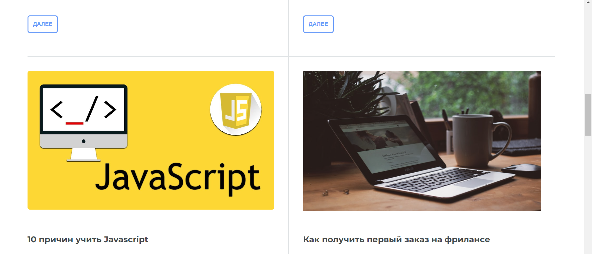
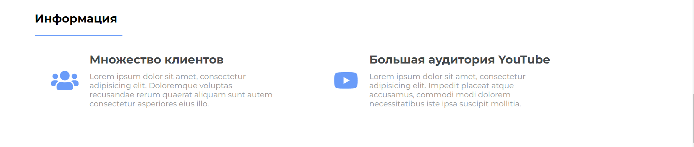

# Web portal

## Link: https://jixlen999.github.io/web-portal-adoptive/

## Description

The project is made using HTML, CSS (SCSS) and a little bit of JavaScript.
It has adoptive version made using media queries.

##### Note: The interface is mostly in russian.

## Screenshots

